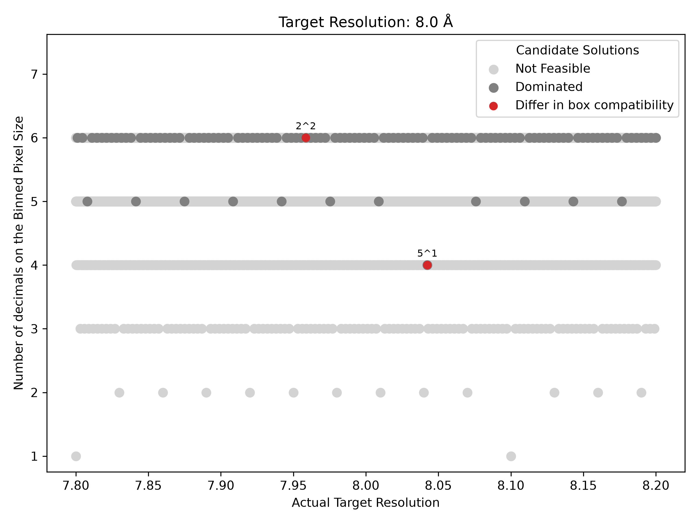

# Find Binning Factor

Find candidate `binning factors` with good FFT-box compatibility and with the least number of decimal places in the associated `binned pixel size`.

## Overview
For a user input:
```YAML
Pixel Size       : 0.5585
Target Resolution: 8.0
```

The output is:
```YAML
rank1:
  binning_factor: 4.8
  binned_pixel_size: 2.6808
  target_resolution: 8.0424
  compatibility_factors: 5^1
  count_compatible_EMAN2boxes: 27
  compatible_boxes: [100, 120, 140, 180, 220, 240, 260, 300, 320, 360, 440, 480, 540, 560, 600, 630, 640, 700, 720, 750, 800, 810, 840, 900, 960, 980, 1000]

rank2:
  binning_factor: 4.75
  binned_pixel_size: 2.652875
  target_resolution: 7.958625
  compatibility_factors: 2^2
  count_compatible_EMAN2boxes: 41
  compatible_boxes: [64, 72, 96, 104, 112, 120, 128, 168, 192, 208, 216, 224, 240, 256, 288, 320, 352, 360, 384, 416, 440, 448, 480, 512, 560, 576, 600, 640, 648, 672, 720, 768, 784, 800, 840, 864, 896, 960, 1000, 1008, 1024]
```

Where the suggestions are ordered first by the number of decimal places in `binned_pixel_size`, and then by `count_compatible_EMAN2boxes`.

| Variable | Description |
| :-------------------------- | :------------------------------------------------------------------------------- |
|`binning_factor`             | The suggested binning factor                                                     |
|`binned_pixel_size`          | The resulting pixel size after binning                                           |
|`target_resolution`          | The actual resolution for this pixel size (which may account for oversampling)   |
|`compatibility_factors`      | A box size must be divisible by this number to be compatible with the suggested binning factor (to result in an even integer box) |
|`count_compatible_EMAN2boxes`| The number of boxes from the EMAN2 list that are compatible with this binning factor |
|`compatible_boxes`           | The specific EMAN2 boxes that are compatible                                         |

## Usage

```bash
python find_binning_factor.py --pixel_size <PIXEL_SIZE> --target_resolution <TARGET_RESOLUTION>
```

### Required arguments

| Argument                    | Description                    |
| :-------------------------- | :----------------------------- |
| `-p`, `--pixel_size`        | Current pixel size in Å/pixel. |
| `-t`, `--target_resolution` | Target resolution in Å.        |

### Additional arguments

| Argument       | Description                   |
| -------------- | ----------------------------- |
| `--verbose`    | Enable verbose logging.       |
| `--output-dir` | Specify a directory to enable saving the output. | 

### Advanced arguments

The defaults for these parameters below are carefully tuned for general use. 
Feel free to experiment with them using the details below.

| Argument                               | Default | Description                                                                                          |
| :------------------------------------- | :-----: | :----------------------------------------------------------------------------------------------------|
| `--sampling_factor`                    |     `3` | Sampling factor used to relate pixel size and resolution. Nyquist sampling: `2`; Oversampling: `>2`. |
| `--search_resolution_radius`           |   `0.2` | Acceptable deviation from the target resolution in Å.                                                |
| `--pixel_max_decimals`                 |     `6` | Maximum number of decimal places allowed for the binned pixel size.                                  |
| `-lb`, `--compatible-box-min-size`     |    `64` | Minimum FFT-friendly box size considered for compatibility (filters the EMAN2 list).                 |
| `-ub`, `--compatible-box-max-size`     |  `1024` | Maximum FFT-friendly box size considered for compatibility (filters the EMAN2 list).                 |
| `-db`, `--compatible-box-divisible-by` |     `2` | Only consider FFT-friendly box sizes divisible by any of the input values. Multiple values can be provided (filters the EMAN2 list). |

## Technical overview
### Search Grid
The search evaluates an exhaustive pixel-size grid within the requested resolution range.

The input target resolution $R_{target}$ and search radius $r$ define the range of pixel sizes $p$ considered:

$$
p_\mathrm{min} = \frac{R_\mathrm{target}-r}{\text{sampling factor}},
\qquad
p_\mathrm{max} = \frac{R_\mathrm{target}+r}{\text{sampling factor}},
$$

Pixel sizes are sampled on a decimal grid determined by the maximum allowed number of decimal places $d$:

$$
p_\mathrm{candidate} \in [p_\mathrm{min}, p_\mathrm{max}] \quad \text{with step size } 10^{-d}
$$

The corresponding binning factor $b$ is calculated as:

$$
b_\mathrm{candidate} = \frac{p_\mathrm{candidate}}{p_\text{user input}}
$$

A candidate solution is the pair ($p_\mathrm{candidate}$, $b_\mathrm{candidate}$)

### Feasibility
The grid generation inherently guarantees that every candidate pixel size has a finite number of decimal places, limited to the specified maximum $d$ (`--pixel_max_decimals`).

Then, we actively filter out candidate binning factors that:
- are non-terminating or
- yield zero compatible boxes from the EMAN2 list

### Evaluation & Dominance
Each candidate solution (the pixel size and its binning factor) is evaluated in order of importance by:
1. The number of decimal places in the pixel size (lower is better).
2. The number of compatible EMAN2 boxes (higher is better).

A candidate solution is considered dominated if another solution exists that has fewer decimal places and more compatible boxes. Because these dominated solutions are redundant, they are removed from the final output.

Note: Deviation from the target resolution is not used in this step, as it is already controlled by the search radius parameter $r$ (`--search_resolution_radius`).

## Output
The script outputs the top 3 solutions, ranked first by the fewest decimal places and then by the most compatible boxes.

If an `--output-dir` is specified, the script will also save:
- `optimal_*.csv`: Contains the complete list of all recommendations.
- `pareto_*.png `: Provides a visual illustration of the search landscape.



The plot shows all candidate solutions evaluated during the binning factor search.
The x-axis shows the actual target resolution (Å) obtained for each candidate, while the y-axis shows the number of decimal places required to represent the resulting binned pixel size.

- **Light gray:** Not feasible candidates.
- **Dark gray:** Feasible candidates.
- **Red:** Optimal solutions, differ in box compatibility factor. 

The binning factor is shown above each solution as an irreducible fraction; the denominator indicates the box compatibility.
